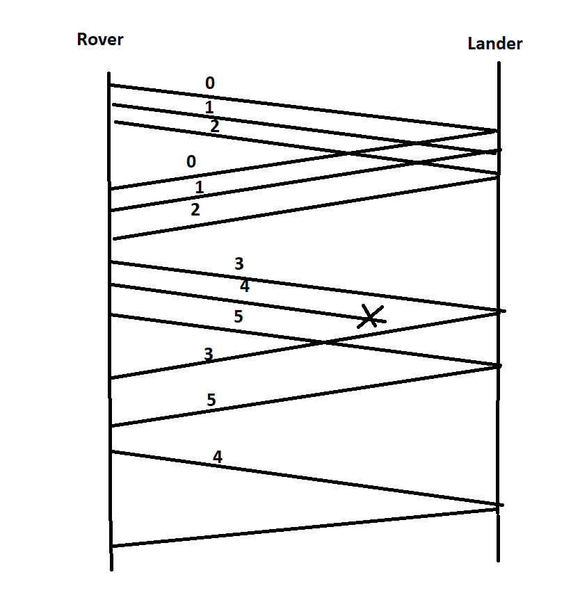

# Custom Reliable Data Transfer Protocol using UDP

The project demonstrates a Reliable Transfer Protocol using UDP. The Rovers from a prior project are used to simulate the protocol. The rovers transmit images to a lander (Another Rover) using the protocol designed.

### To Build
docker build -t javaapptest .

### To create the node network
docker network --subnet=172.18.0.0/16 nodenet

Rover Parameters: 
    Rover_ID
    Lander_IP
    Image_File

### Start Rover
docker run -it -p 8080:8080 --cap-add=NET_ADMIN --net nodenet --ip 172.18.0.21 javaapptest 1 172.18.0.22 test.png

Lander Parameters:
    Lander_ID
    Lander_IP

###Start Lander
docker run -it -p 8080:8080 --cap-add=NET_ADMIN --net nodenet --ip 172.18.0.22 javaapptest 2 172.18.0.22

### Packet Structure

The protocol runs on UDP with a size of 1034 bits which contains 9bits of header and 1024 bits of data.

 

The rover and the lander have two ports. One for sending the data and receiving the Ack and the other for receiving the data and sending the ACK

### Protocol Description

 

The rover starts transmitting 10 packets first and stop. At this point it checks if it has received all the ACKs from the lander. This is done by storing the received ACKs in memory. This way we don’t have to stop transmitting to check if we received once we finish transmitting we can check if all the acks have been received or not. This also avoids the problem of not receiving ACKS in order. If we did not receive an ACK we just retransmit the packet, which are stored temporarily in a HashMap, this way we can directly pick up the packet and send it quickly and we do not have to reconstruct the packet. Once all the packets have been transmitted and we received the respective ACKs then the rover sends the end packet and closes the sockets.

In the lander, all the packets received are stored in a hashmap. This is because we can receive packets in any order and it is important that they are stored so that we can keep track of the packets. If we receive a packet that has been retransmitted we can just check the hashmap to see if it is present if it is we ignore the packet and send an ACK. Once we receive the end packet then we respond with an end ACK and close the connection.

### Advantages over TCP

1. There is no 3 way handshake
2. Timeout for the rovers is 1 min if we do not receive any ACKs and timeout for the landers is 1 min after we receive the last packet
3. We reorder and create the data only after we receive the last packet.
4. If for any reason we cannot recreate the image then we do not send the end ACK.
5. There is no error checking and expects the packet to be resent
6. We store the ACKs so that we don’t have to resend the same packet again.